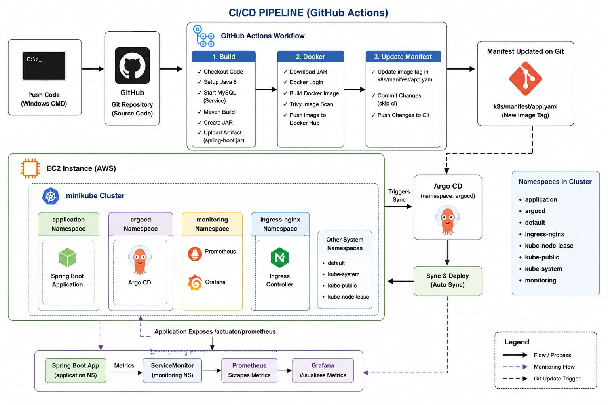

# Veterinary Clinic Management System

This project has been designed in order to meet the necessity of clinic operation demands and carry out the procedures in a fast and practical way. This project was designed using the Spring-Boot framework, following the MVC design pattern. MySql was used as the database during the design phase. JPA, one of the ORM tools, was used to manage the database. While developing the interface, HTML, CSS, BootStrap5 and JavaScript were used. Java and JavaScript(jQuery) languages are used in the back-end part. 


## Technologies Libraries and Frameworks

| Programming Languages |  | Libraries & Technologies |
| ------------- |:-------------:|:-------------:|
| Java | :arrow_right: | Spring-MVC, Spring-Boot, Spring Security, Spring-JPA, Spring-Validation |
| SQL | :arrow_right: | MySQL |
| Front | :arrow_right: | Thymeleaf, Js, jQery, Ajax, Bootstrap 5 |
| Technologies | :arrow_right: | Log4j, Regex |


## Available Roles For Demo Account

| 🔐 Admin Account | ADMIN | SUPER_ADMIN | USER | 🗝️ Password |       
| ------------- |:-------------:|:-------------:|:-------------:|:-------------:|
| ```rezzan.sk@mail.com```	 | x | x | x | 12 |
| ```alper@mail.com```	 | x | - | x | 12 |
| ```ferhat@mail.com```	 | x | - | x | 12 |


## Architecture



# GitHub Actions CI/CD Pipeline for Spring Boot Kubernetes Project

This project implements a CI/CD pipeline using **GitHub Actions, Maven, Docker, Docker Hub, Trivy, Kubernetes manifests, and Argo CD**.

The pipeline is triggered whenever code is pushed to the `main` branch.

---

# CI/CD Architecture

```text
Developer
    |
    | git push
    ▼
GitHub Repository
    |
    | push to main
    ▼
GitHub Actions
    |
    ├──────────────────────────────┐
    │                              │
    ▼                              │
Build Job                          │
├── Checkout source code           │
├── Setup Java 8                   │
├── Start MySQL service            │
├── Maven build                    │
└── Upload JAR artifact            │
                                   │
                                   ▼
                              Docker Job
                              ├── Checkout code
                              ├── Download JAR
                              ├── Login to Docker Hub
                              ├── Build Docker image
                              ├── Trivy security scan
                              └── Push image to Docker Hub
                                   |
                                   ▼
                              Docker Hub
                                   |
                                   ▼
                         Update Manifest Job
                         ├── Checkout repository
                         ├── Update image tag
                         ├── Commit app.yaml
                         └── Push changes to Git
                                   |
                                   ▼
                              Argo CD
                                   |
                                   | Detects Git change
                                   ▼
                              Kubernetes
                                   |
                                   ▼
                           New Application Pod
```

---

# 1. Pipeline Trigger

The workflow is triggered by:

```yaml
on:
  push:
    branches:
      - main
```

This means whenever code is pushed to the `main` branch, GitHub Actions starts the pipeline.

Example:

```bash
git add .
git commit -m "Update application"
git push origin main
```

This triggers the workflow automatically.

---

# 2. GitHub Actions Permissions

The workflow contains:

```yaml
permissions:
  id-token: write
  contents: write
```

### id-token: write

This permission allows GitHub Actions to request an OIDC identity token.

It is useful when GitHub Actions needs to authenticate with cloud providers such as AWS without storing long-lived cloud credentials.

### contents: write

This allows GitHub Actions to push changes back to the GitHub repository.

It is required by the `update-manifest` job because that job modifies and commits:

```text
k8s/manifest/app.yaml
```

---

# 3. Build Job

The first job is:

```yaml
jobs:
  build:
    runs-on: ubuntu-latest
```

This job runs on a GitHub-hosted Ubuntu runner.

The purpose of this job is to:

1. Checkout source code
2. Set up Java
3. Start MySQL
4. Build the Spring Boot application
5. Upload the generated JAR

---

# 4. MySQL Service Container

The build job starts a temporary MySQL container:

```yaml
services:
  mysql:
    image: mysql:8.0
```

The database is configured with:

```yaml
MYSQL_ROOT_PASSWORD: root
MYSQL_DATABASE: vetapp
```

The MySQL container is exposed on:

```text
3306
```

A health check is also configured.

This allows the CI environment to have a MySQL database available while the application is being built/tested.

---

# 5. Checkout Source Code

The workflow uses:

```yaml
- name: copy code
  uses: actions/checkout@v4
```

This checks out the latest source code from the GitHub repository onto the GitHub Actions runner.

Flow:

```text
GitHub Repository
       |
       ▼
GitHub Actions Runner
       |
       ▼
Source Code
```

---

# 6. Setup Java

The pipeline uses:

```yaml
- name: setup java
  uses: actions/setup-java@v5
  with:
    java-version: '8'
    distribution: 'temurin'
```

This installs/configures:

```text
Java 8
Eclipse Temurin
```

on the GitHub Actions runner.

---

# 7. Build Spring Boot Application

The application is built using:

```bash
mvn clean package -DskipTests
```

Maven:

```text
Clean
  ↓
Compile
  ↓
Package
  ↓
Spring Boot JAR
```

The generated JAR is typically created under:

```text
target/
```

For example:

```text
target/spring-boot-application.jar
```

---

# 8. Upload JAR Artifact

The JAR is uploaded using:

```yaml
- name: upload artifact
  uses: actions/upload-artifact@v4
  with:
    name: spring-boot.jar
    path: target/*.jar
```

This allows the next job to download the JAR.

The flow is:

```text
Build Job
    |
    ▼
target/*.jar
    |
    ▼
GitHub Actions Artifact
    |
    ▼
Docker Job
```

---

# 9. Job Dependency

The Docker job contains:

```yaml
needs: build
```

Therefore Docker will only run after the `build` job completes successfully.

```text
build
  |
  | success
  ▼
docker
```

The condition:

```yaml
if: success()
```

also ensures that the job runs only when the previous required job succeeds.

---

# 10. Docker Job

The Docker job performs:

```text
Checkout code
      ↓
Download JAR
      ↓
Docker Hub login
      ↓
Build Docker image
      ↓
Trivy security scan
      ↓
Push Docker image
```

---

# 11. Download JAR

The Docker job downloads the artifact created by the build job:

```yaml
- name: download jar
  uses: actions/download-artifact@v4
  with:
    name: spring-boot.jar
    path: target/
```

This makes the JAR available to the Docker build.

---

# 12. Docker Hub Authentication

The workflow uses:

```yaml
- name: dockerHub Login
  uses: docker/login-action@v3
```

Credentials are stored as GitHub Secrets:

```text
DOCKERHUB_USERNAME
DOCKERHUB_TOKEN
```

The credentials are not hard-coded in the workflow.

---

# 13. Docker Image Build

The Docker image is built using:

```bash
docker build \
  -t ${{ secrets.DOCKERHUB_USERNAME }}/springboot-kubernetes-project:${{ github.run_number }} .
```

The image tag uses:

```text
github.run_number
```

For example:

```text
springboot-kubernetes-project:25
```

The next pipeline run could produce:

```text
springboot-kubernetes-project:26
```

This provides a unique image tag for each workflow run.

---

# 14. Trivy Security Scan

Before pushing the image, the pipeline performs a vulnerability scan using Trivy:

```yaml
- name: Trivy image scan
  uses: aquasecurity/trivy-action@master
```

It scans:

```text
OS packages
Application libraries
```

using:

```yaml
vuln-type: 'os,library'
```

Unfixed vulnerabilities are ignored:

```yaml
ignore-unfixed: true
```

The current configuration uses:

```yaml
exit-code: '0'
```

This means the scan does **not fail the pipeline even when vulnerabilities are found**.

The scan currently acts primarily as a security visibility/checking step.

---

# 15. Push Docker Image

After the image is built and scanned, it is pushed to Docker Hub:

```bash
docker push ${{ secrets.DOCKERHUB_USERNAME }}/springboot-kubernetes-project:${{ github.run_number }}
```

Example:

```text
Docker Hub
└── springboot-kubernetes-project
    ├── 21
    ├── 22
    ├── 23
    ├── 24
    └── 25
```

Each successful pipeline run creates a new image tag.

---

# 16. Update Manifest Job

The final GitHub Actions job is:

```yaml
update-manifest:
  needs: docker
```

This job runs only after the Docker job succeeds.

Its purpose is to update the Kubernetes Deployment manifest with the newly created Docker image.

---

# 17. Checkout Repository

The job first checks out the repository:

```yaml
- name: Checkout code
  uses: actions/checkout@v4
```

This gives the runner access to:

```text
k8s/manifest/app.yaml
```

---

# 18. Update Kubernetes Image

The pipeline uses:

```bash
sed -i "s|image: .*|image: ${{ secrets.DOCKERHUB_USERNAME }}/springboot-kubernetes-project:${{ github.run_number }}|" k8s/manifest/app.yaml
```

Suppose the old manifest contains:

```yaml
image: username/springboot-kubernetes-project:24
```

After the new pipeline run:

```yaml
image: username/springboot-kubernetes-project:25
```

The Kubernetes manifest now points to the newly built Docker image.

---

# 19. Commit Manifest Change

GitHub Actions configures Git:

```bash
git config --global user.name "github-actions"
git config --global user.email "github-actions@github.com"
```

Then:

```bash
git add k8s/manifest/app.yaml
```

and:

```bash
git commit -m "Update image to build ${{ github.run_number }} [skip ci]"
```

Finally:

```bash
git push
```

pushes the updated manifest back to GitHub.

---

# 20. Why `[skip ci]` Is Used

The commit message contains:

```text
[skip ci]
```

This prevents the manifest update from unnecessarily triggering the same CI workflow again.

Without it, the flow could become:

```text
Code Push
   ↓
GitHub Actions
   ↓
Update app.yaml
   ↓
Git Push
   ↓
GitHub Actions
   ↓
Update app.yaml
   ↓
Git Push
   ↓
...
```

Using:

```text
[skip ci]
```

prevents this unwanted CI trigger.

---

# 21. Argo CD Deployment

GitHub Actions does **not directly deploy the application to Kubernetes** in this pipeline.

Instead, GitHub Actions updates:

```text
k8s/manifest/app.yaml
```

and pushes that change to Git.

Argo CD watches the Git repository.

The flow is:

```text
GitHub Actions
      |
      | updates image tag
      ▼
Git Repository
      |
      | detects manifest change
      ▼
Argo CD
      |
      | Sync
      ▼
Kubernetes
      |
      ▼
New Docker Image
      |
      ▼
New Application Pod
```

This is a **GitOps-based deployment approach**.

---

# 22. Complete End-to-End Flow

```text
1. Developer writes code
          ↓
2. git push origin main
          ↓
3. GitHub Actions starts
          ↓
4. Build Job
   ├── Checkout code
   ├── Setup Java 8
   ├── Start MySQL
   ├── Maven package
   └── Upload JAR
          ↓
5. Docker Job
   ├── Download JAR
   ├── Docker Hub login
   ├── Build image
   ├── Trivy scan
   └── Push image
          ↓
6. Update Manifest Job
   ├── Update image tag
   ├── Commit app.yaml
   └── Push to Git
          ↓
7. Argo CD detects Git change
          ↓
8. Argo CD syncs Kubernetes
          ↓
9. Kubernetes performs deployment
          ↓
10. New application version is running
```

---

# 23. GitHub Secrets Used

The workflow references:

```text
DOCKERHUB_USERNAME
DOCKERHUB_TOKEN
```

These should be configured in:

```text
GitHub Repository
→ Settings
→ Secrets and variables
→ Actions
```

Never hard-code Docker Hub credentials directly in the workflow.

---
# 24. CI/CD Summary

```text
Git Push
   ↓
GitHub Actions
   ↓
Maven Build
   ↓
JAR Artifact
   ↓
Docker Build
   ↓
Trivy Scan
   ↓
Docker Hub
   ↓
Update Kubernetes Manifest
   ↓
Git Push
   ↓
Argo CD
   ↓
Kubernetes
   ↓
Application Deployment
```

## Result

The complete process is automated from **source-code push to Kubernetes deployment**, while Argo CD maintains Kubernetes deployment through the Git repository as the source of truth.


# Prometheus & Grafana Monitoring Setup for Spring Boot on Kubernetes

This project demonstrates how to monitor a Spring Boot application running on Kubernetes using **Prometheus** and **Grafana**.

Prometheus and Grafana are installed in the Kubernetes cluster using **Helm**.

---

## Architecture

```text
                    ┌─────────────────────────────┐
                    │       Spring Boot App       │
                    │       Namespace: application│
                    │                             │
                    │  /actuator/prometheus      │
                    │  exposes application metrics│
                    └──────────────┬──────────────┘
                                   │
                                   │ HTTP :8080
                                   ▼
                    ┌─────────────────────────────┐
                    │      application-service   │
                    │      Namespace: application │
                    │                             │
                    │      port: 8080             │
                    │      targetPort: 8080       │
                    └──────────────┬──────────────┘
                                   │
                                   │ ServiceMonitor
                                   │ discovers service
                                   ▼
                    ┌─────────────────────────────┐
                    │          Prometheus         │
                    │       Namespace: monitoring  │
                    │                             │
                    │ Scrapes metrics every 15s  │
                    └──────────────┬──────────────┘
                                   │
                                   │ PromQL queries
                                   ▼
                    ┌─────────────────────────────┐
                    │           Grafana            │
                    │       Namespace: monitoring  │
                    │                             │
                    │ Dashboards & Visualization  │
                    └─────────────────────────────┘
```

---

# 1. Components Installed

The monitoring stack was installed using Helm and contains the following major components:

### Prometheus

Prometheus is responsible for:

- Discovering monitoring targets
- Scraping metrics from applications
- Storing metrics as time-series data
- Providing the PromQL query language
- Making metrics available to Grafana

### Grafana

Grafana is responsible for:

- Connecting to Prometheus
- Querying Prometheus using PromQL
- Creating dashboards
- Displaying metrics using graphs, tables, gauges, etc.
- Visualizing application and Kubernetes metrics

### Prometheus Operator

The Prometheus Operator simplifies Prometheus configuration in Kubernetes.

It manages resources such as:

- Prometheus
- ServiceMonitor
- PodMonitor
- Alertmanager
- PrometheusRule

In this setup, the important resource is the **ServiceMonitor**.

### kube-state-metrics

kube-state-metrics exposes Kubernetes object information as metrics.

For example:

- Pod status
- Deployment replicas
- Deployment availability
- DaemonSet status
- StatefulSet status

### Node Exporter

Node Exporter exposes infrastructure-level metrics from Kubernetes nodes.

Examples:

- CPU usage
- Memory usage
- Disk usage
- Network statistics

### Alertmanager

Alertmanager handles alerts generated by Prometheus.

It can route alerts to notification systems such as:

- Email
- Slack
- PagerDuty
- Other notification receivers

---

# 2. Kubernetes Namespaces

The application is running in:

```text
application
```

The monitoring stack is running in:

```text
monitoring
```

This separation keeps application resources and monitoring resources organized.

---

# 3. Spring Boot Metrics

The Spring Boot application exposes Prometheus-compatible metrics through:

```text
/actuator/prometheus
```

Example:

```text
http://<application-service>:8080/actuator/prometheus
```

The endpoint returns metrics in a format that Prometheus understands.

Example metrics can include:

```text
jvm_memory_used_bytes
jvm_memory_max_bytes
process_cpu_usage
http_server_requests_seconds_count
system_cpu_usage
```

---

# 4. Service Configuration

The following Kubernetes Service exposes the Spring Boot application inside the `application` namespace:

```yaml
apiVersion: v1
kind: Service
metadata:
  name: application-service
  namespace: application
  labels:
    app: monitoring
spec:
  selector:
    app: application
  ports:
    - name: http
      port: 8080
      targetPort: 8080
```

The important parts are:

```yaml
selector:
  app: application
```

This tells Kubernetes to send traffic to pods having:

```text
app=application
```

The service exposes:

```text
Service port: 8080
Target port: 8080
```

---

# 5. ServiceMonitor

The ServiceMonitor tells Prometheus:

> "Find the required Kubernetes Service and scrape metrics from it."

The ServiceMonitor used in this project is:

```yaml
apiVersion: monitoring.coreos.com/v1
kind: ServiceMonitor
metadata:
  name: spring-boot-monitor
  namespace: monitoring
  labels:
    release: monitoring
spec:
  selector:
    matchLabels:
      app: application

  namespaceSelector:
    matchNames:
      - application

  endpoints:
    - port: http
      path: /actuator/prometheus
      interval: 15s
```

---

# 6. How ServiceMonitor Finds the Service

This is an important concept.

The ServiceMonitor contains:

```yaml
selector:
  matchLabels:
    app: application
```

So Prometheus Operator looks for a Service with:

```text
app=application
```

Our monitoring Service has:

```yaml
labels:
  app: application
```

Therefore:

```text
ServiceMonitor
      |
      | searches for
      ▼
Service with app=application
      |
      ▼
application-service
```

The ServiceMonitor also contains:

```yaml
namespaceSelector:
  matchNames:
    - application
```

This tells it to search for the Service in the:

```text
application
```

namespace.

---

# 7. Metrics Endpoint

The ServiceMonitor specifies:

```yaml
endpoints:
  - port: http
    path: /actuator/prometheus
    interval: 15s
```

The `port` value:

```yaml
port: http
```

refers to the **name of the Service port**, not simply the number.

Our Service defines:

```yaml
ports:
  - name: http
    port: 8080
    targetPort: 8080
```

Therefore the ServiceMonitor can identify the HTTP port using:

```text
http
```

Prometheus then requests:

```text
/actuator/prometheus
```

every:

```text
15 seconds
```

---

# 8. Complete Metrics Flow

The complete flow is:

```text
Spring Boot Application
        |
        | exposes
        ▼
/actuator/prometheus
        |
        ▼
Kubernetes Service
application-service:8080
        |
        ▼
ServiceMonitor
spring-boot-monitor
        |
        ▼
Prometheus Operator
        |
        | configures Prometheus
        ▼
Prometheus
        |
        | scrapes every 15 seconds
        ▼
Spring Boot metrics
        |
        | stored as time-series data
        ▼
Prometheus Database
        |
        | PromQL
        ▼
Grafana
        |
        ▼
Dashboard
```

---

# 9. What Actually Happens Inside Prometheus

Prometheus does not continuously receive metrics from the application.

Instead, Prometheus **pulls/scrapes** the metrics endpoint.

Every 15 seconds, Prometheus performs approximately:

```text
GET /actuator/prometheus
```

The Spring Boot application responds with metrics.

For example:

```text
jvm_memory_used_bytes 123456789
process_cpu_usage 0.12
```

Prometheus stores these values with timestamps as time-series data.

Conceptually:

```text
Metric
  |
  +--- Timestamp 10:00 -> Value
  +--- Timestamp 10:15 -> Value
  +--- Timestamp 10:30 -> Value
  +--- Timestamp 10:45 -> Value
```

This historical data can then be queried using PromQL.

---

# 10. Grafana's Role

Grafana does **not** normally collect metrics directly from the Spring Boot application.

Instead:

```text
Spring Boot
     ↓
Prometheus
     ↓
Grafana
```

Grafana uses Prometheus as its **data source**.

For example, Grafana can execute a PromQL query such as:

```promql
process_cpu_usage
```

or:

```promql
jvm_memory_used_bytes
```

Prometheus returns the time-series data to Grafana.

Grafana then converts the data into visualizations.

---

# 11. Example Grafana Dashboard

A dashboard can contain panels such as:

### JVM Memory Used

PromQL:

```promql
jvm_memory_used_bytes
```

This shows the amount of JVM memory currently being used.

### JVM Memory Percentage

For example:

```promql
100 * jvm_memory_used_bytes / jvm_memory_max_bytes
```

This can be displayed using a Gauge or Time Series panel.

### CPU Usage

Example:

```promql
process_cpu_usage
```

This shows the CPU usage of the Spring Boot process.

### HTTP Request Count

Example:

```promql
http_server_requests_seconds_count
```

This can be used to understand the number of HTTP requests handled by the application.

---

# 12. Kubernetes Monitoring

The monitoring stack can also monitor Kubernetes itself.

The major components are:

```text
Node Exporter
      |
      └── Node-level metrics

kube-state-metrics
      |
      └── Kubernetes object/state metrics

Prometheus
      |
      └── Collects and stores metrics

Grafana
      |
      └── Visualizes metrics
```

Examples include:

```text
Pod status
Pod restarts
CPU usage
Memory usage
Node CPU
Node memory
Deployment replicas
Container information
```

---

# 13. Important Difference Between the Services

There are two Services shown in the Kubernetes configuration.

## application-service

```yaml
metadata:
  name: application-service
  namespace: application
  labels:
    app: application
```

This Service is used by the **ServiceMonitor**.

The important label is:

```text
app=application
```

because the ServiceMonitor searches for this label.

---

## appsvc

```yaml
metadata:
  name: appsvc
  namespace: application
spec:
  type: NodePort
```

This Service exposes the application through a NodePort:

```text
30002
```

It is intended for application access, while `application-service` is the Service selected by the ServiceMonitor.

The two Services serve different purposes.

---

# 14. Very Important Label Matching

There are two different selectors in this setup.

### ServiceMonitor → Service

ServiceMonitor:

```yaml
selector:
  matchLabels:
    app: application
```

Service:

```yaml
labels:
  app: application
```

These must match.

---

### Service → Pod

`application-service`:

```yaml
selector:
  app: application
```

Application Pods must therefore have:

```yaml
labels:
  app: application
```

So the complete relationship is:

```text
ServiceMonitor
     |
     | selects Service by label
     | app=application
     ▼
application-service
     |
     | selects Pods by label
     | app=application
     ▼
Spring Boot Pods
```

---

# 15. ServiceMonitor Release Label

The ServiceMonitor contains:

```yaml
labels:
  release: monitoring
```

This label is important when using the Prometheus Operator Helm installation.

The Helm-installed Prometheus configuration commonly uses a selector that watches ServiceMonitors with the appropriate release label.

In this setup:

```text
release=monitoring
```

allows the installed Prometheus instance to discover this ServiceMonitor, assuming the Helm chart's ServiceMonitor selector is configured accordingly.

---

# 16. Verify the Monitoring Stack

Check all monitoring pods:

```bash
kubectl get pods -n monitoring
```

Expected output includes components similar to:

```text
alertmanager-monitoring-kube-prometheus-alertmanager-0
monitoring-grafana-xxxxx
monitoring-kube-prometheus-operator-xxxxx
monitoring-kube-state-metrics-xxxxx
monitoring-prometheus-node-exporter-xxxxx
prometheus-monitoring-kube-prometheus-prometheus-0
```

---

# 17. Verify the ServiceMonitor

Run:

```bash
kubectl get servicemonitor -n monitoring
```

You should see:

```text
spring-boot-monitor
```

To inspect it:

```bash
kubectl describe servicemonitor spring-boot-monitor -n monitoring
```

---

# 18. Verify the Application Service

Run:

```bash
kubectl get svc -n application
```

You should see:

```text
application-service
appsvc
```

Check the Service labels:

```bash
kubectl get svc application-service -n application --show-labels
```

Expected label:

```text
app=application
```

---

# 19. Verify Service Endpoints

Check whether the Service is actually connected to application Pods:

```bash
kubectl get endpoints application-service -n application
```

or:

```bash
kubectl get endpointslice -n application
```

The Service should have endpoints corresponding to the Spring Boot Pods.

If there are no endpoints, check the Pod labels:

```bash
kubectl get pods -n application --show-labels
```

The Service selector and Pod labels must match.

---

# 20. Verify the Metrics Endpoint

You can test the Spring Boot metrics endpoint from inside the cluster.

For example, use a temporary curl Pod:

```bash
kubectl run curl-test \
  --rm -it \
  --image=curlimages/curl \
  -n application \
  -- sh
```

Then:

```bash
curl http://application-service:8080/actuator/prometheus
```

If everything is configured correctly, you should receive Prometheus-formatted metrics.

---

# 21. Verify Prometheus Target

Port-forward Prometheus:

```bash
kubectl port-forward -n monitoring \
  svc/monitoring-kube-prometheus-prometheus \
  9090:9090
```

Open:

```text
http://localhost:9090
```

Go to:

```text
Status → Targets
```

Look for the Spring Boot application target.

It should show a healthy state such as:

```text
UP
```

If the target is `DOWN`, check:

1. ServiceMonitor
2. Service labels
3. Service port name
4. Service endpoints
5. `/actuator/prometheus`
6. Network connectivity
7. Prometheus ServiceMonitor selector

---

# 22. Verify Prometheus Queries

In the Prometheus UI, try:

```promql
up
```

This shows whether discovered targets are available.

For the Spring Boot application, you can search for metrics such as:

```promql
jvm_memory_used_bytes
```

or:

```promql
process_cpu_usage
```

If the query returns data, Prometheus is successfully collecting the application metrics.

---

# 23. Grafana Setup

Port-forward Grafana:

```bash
kubectl port-forward -n monitoring \
  svc/monitoring-grafana \
  3000:80
```

Open:

```text
http://localhost:3000
```

Log in to Grafana.

Add Prometheus as a data source if it is not already configured.

The Prometheus service is available inside the Kubernetes cluster.

For example:

```text
http://monitoring-kube-prometheus-prometheus:9090
```

The exact service name can be verified with:

```bash
kubectl get svc -n monitoring
```

---

# 24. Create a Grafana Dashboard

Create a new dashboard and add a panel.

Example PromQL:

```promql
jvm_memory_used_bytes
```

Choose:

```text
Visualization → Time series
```

Grafana will display JVM memory usage over time.

Another example:

```promql
process_cpu_usage
```

This can be displayed as a Time series or Gauge.

---

# 25. Troubleshooting

## Problem: ServiceMonitor exists but Prometheus does not show the target

Check:

```bash
kubectl get servicemonitor -n monitoring
```

Then:

```bash
kubectl describe servicemonitor spring-boot-monitor -n monitoring
```

Check the Service:

```bash
kubectl get svc application-service -n application --show-labels
```

The label must match:

```text
app=application
```

---

## Problem: Target is DOWN

Check the endpoint:

```bash
kubectl get endpoints application-service -n application
```

Check the Pods:

```bash
kubectl get pods -n application --show-labels
```

Test:

```bash
curl http://application-service:8080/actuator/prometheus
```

Also verify that the Service port is named:

```yaml
name: http
```

because the ServiceMonitor uses:

```yaml
port: http
```

---

## Problem: Grafana shows "No Data"

First check Prometheus.

Run:

```promql
up
```

Then:

```promql
jvm_memory_used_bytes
```

If Prometheus has no data, the issue is between:

```text
Spring Boot → Service → ServiceMonitor → Prometheus
```

If Prometheus has data but Grafana does not, check:

```text
Grafana → Data Sources → Prometheus
```

and verify the Prometheus URL and connection.

---

# 26. Helm Installation

The monitoring stack can be installed using the Prometheus Community `kube-prometheus-stack` Helm chart.

Example:

```bash
helm repo add prometheus-community \
  https://prometheus-community.github.io/helm-charts

helm repo update
```

Install:

```bash
helm install monitoring \
  prometheus-community/kube-prometheus-stack \
  -n monitoring \
  --create-namespace
```

Verify:

```bash
helm list -n monitoring
```

And:

```bash
kubectl get pods -n monitoring
```

---

# 27. Final End-to-End Flow

The complete monitoring architecture is:

```text
                  Kubernetes Cluster
                         |
          ┌──────────────┴──────────────┐
          |                             |
          ▼                             ▼
   application namespace          monitoring namespace
          |                             |
          ▼                             |
   Spring Boot Pod                     |
          |                             |
          | /actuator/prometheus        |
          ▼                             |
   application-service                  |
          |                             |
          └──────────────┐              |
                         ▼              |
                  ServiceMonitor        |
                         |              |
                         ▼              |
                Prometheus Operator     |
                         |              |
                         ▼              |
                    Prometheus <────────┘
                         |
                         | PromQL
                         ▼
                      Grafana
                         |
                         ▼
                    Dashboards
```

---

# 28. Key Takeaways

### Prometheus

**Collects and stores metrics.**

```text
Application → Prometheus
```

### ServiceMonitor

**Tells Prometheus Operator what Kubernetes Service to monitor and which endpoint to scrape.**

```text
ServiceMonitor → Service → /actuator/prometheus
```

### Grafana

**Reads metrics from Prometheus and visualizes them.**

```text
Prometheus → Grafana → Dashboard
```

### Kubernetes Service

**Provides a stable network endpoint for the application Pods.**

### Prometheus Operator

**Manages Prometheus configuration and discovers Kubernetes monitoring resources such as ServiceMonitors.**

---


